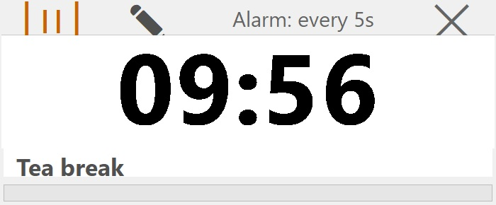
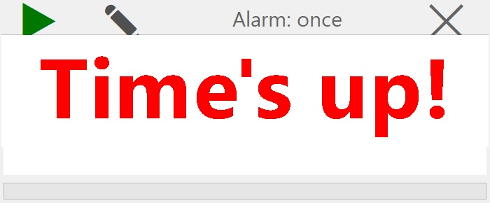

# DesktopCountdown 
A nostalgic, offline‑first desktop countdown **timer** inspired by classic Windows PowerToys.
It floats on your desktop, always on top, and stays out of your way.

## Features

- **Multiple independent timers** – open as many as you need.
- **Custom alarm sounds** – browse any `.wav` file, or fall back to the built‑in default.
- **Adaptive repeat** – automatically plays the full sound, then waits the chosen interval before repeating.
- **Optional labels** – add a name (e.g., “Pomodoro”, “Tea”) to each timer.
- **Session logging** – finished timers are saved to a CSV file for review if you want.
- **Opacity control** – make the timer blend into your desktop.
- **Always‑on‑top** – keep the timer visible over other windows.
- **Zero internet / no accounts** – everything stays on your machine.
- **Single portable executable** – no installation required.

## This archive includes the executable program: **DesktopCountdown.exe**, which is suitable for **Windows 10** and over. You should click on the executable to run.
[Download the archive for win64](https://drive.google.com/file/d/1A6ZHwODnU9S4QRf8A54bAPF4n1BI1-2Y/view?usp=sharing)
---

<table>
  <tr>

<td>
Figure 1: A snapshot of the app: DesktopCountdown, version 0.0, while counting down.</td>
    
<td>
Figure 2: A snapshot of the app: DesktopCountdown, version 0.0, when alarming.</td>

  </tr>
</table>

---